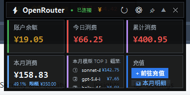

# OpenRouter Dashboard
- by Claude Sonnet 4.6 & Gemini3.5 Flash
一个运行在 Windows 桌面上的 OpenRouter 用量监控悬浮窗。


## 功能

- **灵动岛模式**：平时收缩为顶部胶囊，点击展开完整看板
- **实时用量**：显示当日 / 本月 Token 用量与消费金额
- **配额进度条**：直观显示本月已用配额百分比
- **每日弹窗**：点击日期卡片，查看最近 30 天每日用量 + 迷你柱状图
- **多 Key 支持**：在设置中添加多个 API Key，汇总展示总用量
- **CNY 模式**：支持按人民币汇率显示费用
- **贴边吸附**：拖动窗口靠近屏幕边缘自动吸附
- **透明度 / 置顶**：右键菜单可调节透明度与是否置顶
- **Windows 11 原生圆角与阴影**

## 截图

**胶囊状态（灵动岛）**


**展开状态（完整看板）**



## 快速开始

### 方式一：直接运行 Python

```bash
# 安装依赖
pip install requests

# 运行
python main.py
```

### 方式二：使用打包好的 exe

直接运行 `OpenRouter-Dashboard.exe`（无需安装 Python）。

## 配置

首次运行后，在右键菜单选择 **Settings** 填入 API Key，或直接编辑 `config.json`：

```json
{
  "api_key": "sk-or-v1-你的key",
  "refresh_sec": 60,
  "alpha": 0.93,
  "pinned": true,
  "cny_mode": false,
  "cny_rate": 7.0,
  "extra_keys": [],
  "mgmt_key": ""
}
```

| 字段 | 说明 |
|------|------|
| `api_key` | OpenRouter API Key（必填） |
| `refresh_sec` | 自动刷新间隔（秒），默认 60 |
| `alpha` | 窗口透明度，0.1 ~ 1.0 |
| `pinned` | 是否置顶 |
| `cny_mode` | 是否以人民币显示费用 |
| `cny_rate` | 美元兑人民币汇率 |
| `extra_keys` | 额外 API Key 列表（用于多账号汇总） |
| `mgmt_key` | Management API Key（查询配额） |

## 操作说明

| 操作 | 效果 |
|------|------|
| 单击窗口 | 切换胶囊 / 展开状态 |
| 拖动窗口 | 移动位置，松开自动贴边 |
| 右键菜单 | 设置 / 刷新 / 透明度 / 置顶 / 退出 |
| 点击日期卡片 | 弹出每日用量详情 |

## 打包为 exe

```bash
pip install pyinstaller
pyinstaller --onefile --windowed --name OpenRouter-Dashboard main.py
```

## License

MIT
